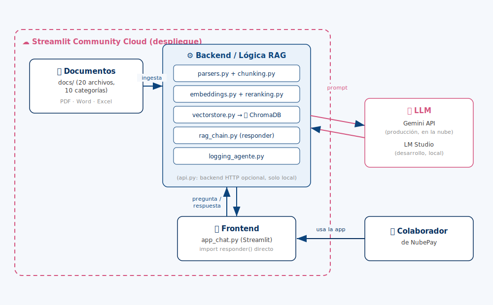

<div align="center">

<br/>
<br/>
<br/>

# 🤖 NubePay — Agente de IA Corporativo

### Un agente conversacional interno que responde preguntas de los colaboradores de NubePay basándose en la documentación oficial de la empresa.

*Proyecto final del desafío de Inteligencia Artificial — [Alura](https://www.alura.com.br/)*

[](https://www.python.org/)
[](https://streamlit.io/)
[](https://www.langchain.com/)
[](https://www.trychroma.com/)
[](https://ai.google.dev/)
[](https://fastapi.tiangolo.com/)
[]()
[]()

**[🚀 Probar la app en vivo](https://nubepay-agent.streamlit.app/)** · **[📂 Repositorio](https://github.com/Cristinasigampat/nubepay-agent)**

</div>

---

## 📑 Índice

- [Descripción del proyecto](#-descripción-del-proyecto)
- [Estado del proyecto](#-estado-del-proyecto)
- [⚠️ Nota sobre el despliegue (OCI → Streamlit Cloud)](#️-nota-sobre-el-despliegue-oci--streamlit-cloud)
- [Demostración](#-demostración)
- [Acceso al proyecto](#-acceso-al-proyecto)
- [Tecnologías utilizadas](#-tecnologías-utilizadas)
- [Arquitectura y flujo](#-arquitectura-y-flujo)
- [Estructura del proyecto](#-estructura-del-proyecto)
- [Instalación y uso local](#-instalación-y-uso-local)
- [Roadmap](#-roadmap)
- [📚 Documentación adicional](#-documentación-adicional)
- [Personas desarrolladoras](#-personas-desarrolladoras)

---

## 📖 Descripción del proyecto

**NubePay** es un banco digital ficticio para Latinoamérica ("finanzas que fluyen"), creado como caso de estudio para este desafío. Este repositorio contiene un **agente de IA corporativo (RAG — Retrieval-Augmented Generation)** capaz de responder preguntas de los colaboradores de NubePay basándose **únicamente** en la documentación interna real de la empresa (políticas de RRHH, legal, financiero, operacional, etc.), citando siempre sus fuentes y evitando alucinaciones.

El proyecto cubre el pipeline completo: recolección y gobierno de documentos → extracción multi-formato → chunking → embeddings → base vectorial → reranking → generación de respuestas → interfaz de chat → despliegue en la nube.

## ✅ Estado del proyecto

**Completo y desplegado**, con limitaciones conocidas documentadas conscientemente (ver [Roadmap](#-roadmap)) en vez de ocultadas. Validado en producción con preguntas reales, tanto dentro del alcance de la documentación como fuera de él (para confirmar que el agente reconoce sus propios límites).

## ⚠️ Nota sobre el despliegue (OCI → Streamlit Cloud)

El desafío sugiere Oracle Cloud Infrastructure (OCI) como plataforma de despliegue. Se intentó registrar una cuenta OCI Free Tier repetidas veces, pero el proceso de verificación de tarjeta de crédito fue rechazado de forma persistente (se contactó también a soporte de Oracle, sin resolución a tiempo para la entrega). Ante esto, se tomó la decisión consciente de desplegar en **[Streamlit Community Cloud](https://streamlit.io/cloud)** — un servicio de hosting gratuito que no requiere tarjeta — para garantizar que el agente esté real y públicamente accesible en la nube, cumpliendo el espíritu del requisito aunque no con la plataforma sugerida originalmente.

## 🎬 Demostración

<!-- TODO: insertar acá la captura o el GIF/video del agente respondiendo en la nube (Clase 16 del plan de clases) -->

*(Video/captura del agente funcionando en `nubepay-agent.streamlit.app` — próximamente en esta sección)*

**Funcionalidades principales:**
- 💬 Chat con burbujas estilo WhatsApp (usuario a la derecha, agente a la izquierda)
- 📄 Citación de fuentes en cada respuesta (documento + categoría)
- 🎯 Filtro de búsqueda por área/categoría de la empresa
- 👍👎 Feedback en cada respuesta, registrado para monitoreo de calidad
- ⚠️ Aviso explícito de que se conversa con un agente de IA, no una persona
- 🚫 Reconoce cuándo no tiene información suficiente, en vez de inventar una respuesta

## 🔗 Acceso al proyecto

| | |
|---|---|
| 🌐 App en vivo | **https://nubepay-agent.streamlit.app/** |
| 💻 Repositorio | https://github.com/Cristinasigampat/nubepay-agent |


## 🛠️ Tecnologías utilizadas
 
<table>
<tr>
<td align="center" width="110"><br/><sub><b>Python 3.11</b></sub></td>
<td align="center" width="110"><br/><sub><b>LangChain</b></sub></td>
<td align="center" width="110">🗄️<br/><sub><b>ChromaDB</b></sub></td>
<td align="center" width="110">🤖<br/><sub><b>Sentence-<br/>Transformers</b></sub></td>
<td align="center" width="110"><br/><sub><b>Gemini API</b></sub></td>
</tr>
<tr>
<td align="center" width="110"><br/><sub><b>FastAPI</b></sub></td>
<td align="center" width="110"><br/><sub><b>Streamlit</b></sub></td>
<td align="center" width="110"><br/><sub><b>Pandas</b></sub></td>
<td align="center" width="110"><br/><sub><b>Git</b></sub></td>
<td align="center" width="110"><br/><sub><b>GitHub</b></sub></td>
</tr>
</table>


- **Orquestación RAG:** LangChain
- **Base vectorial:** ChromaDB
- **Embeddings:** `sentence-transformers` (modelo local, multilingüe) — `paraphrase-multilingual-MiniLM-L12-v2`
- **Reranking:** Cross-encoder (`mmarco-mMiniLMv2-L12-H384-v1`)
- **LLM:** Gemini API en producción (`gemini-3.1-flash-lite`) / LM Studio en desarrollo local
- **Parsers de documentos:** `pdfplumber`, `python-docx`, `pandas`/`openpyxl`, `python-pptx`, `beautifulsoup4`
- **Backend:** FastAPI (disponible para uso local; el despliegue en la nube llama a la cadena RAG directo)
- **Frontend:** Streamlit
- **Despliegue:** Streamlit Community Cloud


## 🏗️ Arquitectura y flujo



El **Frontend** (Streamlit) y el **Backend/Lógica RAG** corren juntos, dentro de Streamlit Community Cloud, como una sola app. Los **Documentos** se procesan e indexan en ChromaDB en el primer arranque. El **LLM** es el único componente externo: Gemini API en producción, o LM Studio corriendo en la PC de quien desarrolla localmente.

## 📂 Estructura del proyecto

```
nubepay-agent/
├── .streamlit/
│   └── config.toml                 # Tema visual fijo + menú oculto
├── assets/                         # Logo, CSS, imágenes del personaje
├── docs/                           # Base de conocimiento (20 docs, 10 categorías)
│   ├── legal_compliance/
│   ├── financiero/
│   ├── rh/
│   ├── estrategico/
│   ├── operacional/
│   ├── datos_sistemas/
│   ├── calidad/
│   ├── comunicacion_interna/
│   ├── marketing_comercial/
│   └── investigacion_desarrollo/
├── src/
│   ├── agente/                     # Código real del proyecto
│   │   ├── parsers.py
│   │   ├── chunking.py
│   │   ├── embeddings.py
│   │   ├── vectorstore.py
│   │   ├── reranking.py
│   │   ├── rag_chain.py
│   │   ├── logging_agente.py
│   │   ├── indexar_documentos.py
│   │   ├── api.py                  # Backend FastAPI (uso local opcional)
│   │   └── app_chat.py             # Frontend Streamlit (el que se despliega)
│   └── practica/                   # Ejercicios de aprendizaje (no productivo)
├── Registro_de_fuentes_y_gobierno_de_documentos.md
├── Plan_de_clases_RAG.md
├── requirements.txt
├── .env.example
└── README.md
```

## ⚙️ Instalación y uso local

### Requisitos mínimos

- **Python 3.10 o superior** (probado con 3.11)
- **~4 GB de espacio libre en disco** (modelos de embeddings + reranking se descargan localmente, ~1 GB, más las dependencias de Python)
- **8 GB de RAM** recomendados (los modelos de embeddings y reranking corren en CPU)
- **Conexión a internet** (para descargar dependencias y modelos la primera vez, y para usar la API de Gemini)
- **[LM Studio](https://lmstudio.ai/)** instalado, si querés desarrollar en modo local con un LLM gratuito sin límites (alternativa: usar Gemini también en desarrollo)
- Una **API key de [Google AI Studio](https://aistudio.google.com/)**, si vas a usar Gemini (obligatorio para el modo producción)

### Paso 1 — Cloná el repositorio

```powershell
git clone https://github.com/Cristinasigampat/nubepay-agent.git
cd nubepay-agent
```

### Paso 2 — Creá y activá un entorno virtual

```powershell
python -m venv venv
.\venv\Scripts\Activate.ps1
```

### Paso 3 — Instalá las dependencias

```powershell
pip install -r requirements.txt
```

### Paso 4 — Configurá las variables de entorno

```powershell
copy .env.example .env
```
Abrí el `.env` creado y completá `GEMINI_API_KEY` con tu clave real.

### Paso 5 — Indexá los documentos (una sola vez)

```powershell
python src/agente/indexar_documentos.py
```

### Paso 6 — Elegí tu LLM de desarrollo

- **Modo local (gratis, sin límites):** abrí LM Studio y activá el servidor local. No hace falta tocar `.env`.
- **Modo Gemini directo:** agregá `ENTORNO=produccion` a tu `.env`.

### Paso 7 — Corré la app

```powershell
streamlit run src/agente/app_chat.py
```

### (Opcional) Backend FastAPI

Para consumir el agente vía API en vez de la interfaz de chat:
```powershell
uvicorn src.agente.api:app --reload
```
Documentación interactiva disponible en `http://localhost:8000/docs`.

## 🗺️ Roadmap

### Historial de versiones

- **`v1.0.0`** — Agente RAG completo, funcionando 100% local: parsers multi-formato, chunking, embeddings, ChromaDB, reranking, cadena RAG con umbrales de confianza, logging local, backend FastAPI, frontend Streamlit.

- **`v2.0.0`** — Agente desplegado y accesible públicamente en la nube (Streamlit Community Cloud): soporte para Gemini como LLM de producción, frontend adaptado para llamar a la cadena RAG directo, autoindexado de documentos en el primer arranque, tema visual fijo, logs visibles desde el panel de la nube, README final.

### 🚧 Pendiente

Mejoras identificadas durante el desarrollo y la sesión de QA, documentadas conscientemente en vez de ocultadas:

- [ ] Memoria conversacional multi-turno (el historial se ve en pantalla, pero cada pregunta se procesa de forma aislada)
- [ ] Pipeline automático de actualización de documentos (hoy la reindexación es manual)
- [ ] Trocear por secciones numeradas en vez de por tamaño fijo (reduciría la mezcla de temas distintos en un mismo chunk)
- [ ] Revisar el `chunk_size` de la categoría `rh`
- [ ] Reducir aún más la contaminación residual de fuentes citadas
- [ ] OCR para PDFs escaneados (no aplica hoy — los 20 documentos son nativos)
- [ ] Detección de estructura de tablas dentro de PDFs con librerías más avanzadas
- [ ] Mejorar el formato visual de las categorías del selector y de las fuentes citadas
- [ ] Corregir superposición del historial del chat con la caja de entrada al scrollear
- [ ] Panel de administración para cargar y gestionar documentos desde la interfaz
- [ ] Armado de panel (dashboard) para monitoreo de datos en logs


## 📚 Documentación adicional

Este proyecto documentó su propio proceso de construcción, no solo el resultado final:

- **[`Registro_de_fuentes_y_gobierno_de_documentos.md`](./Registro_de_fuentes_y_gobierno_de_documentos.md)** — mapeo de fuentes, categorización, ownership, curaduría y limitaciones conocidas (Etapa 1 del desafío).

- **[`Plan_de_clases_RAG.md`](./Plan_de_clases_RAG.md)** — bitácora clase por clase de todo el desarrollo, incluyendo bugs encontrados, decisiones tomadas y por qué.

## 👩‍💻 Personas desarrolladoras

| [Cristina Sigampa Taire](https://github.com/Cristinasigampat) |
|---|
| Desarrollo, QA y diseño del agente |
